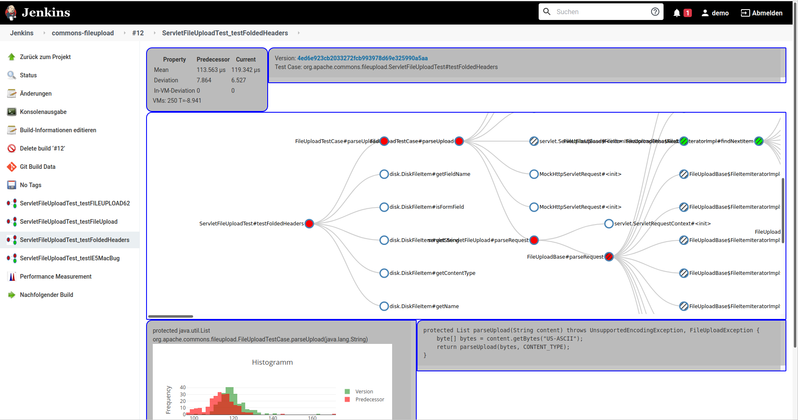
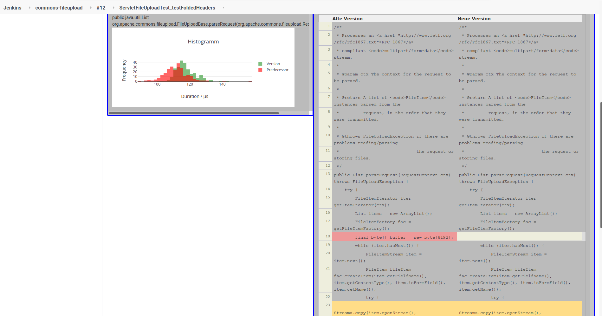

This is the peass-ci-Plugin, enabling a continuous performance measurement for Java projects in an Jenkins server.

# Building

First get peass by running `git clone https://github.com/DaGeRe/peass.git && cd peass && mvn clean install -DskipTests`. Then, execute `mvn clean package`.

# Running

For testing, run `mvn hpi:run` and access `localhost:8080/jenkins`. 

For the easiest setup, get the .war-file of Jenkins (https://www.jenkins.io/download/) and run it using `java -jar jenkins.war`. Stop jenkins, copy `target/peass-ci.hpi` (which was created by building) to `~/.jenkins/plugins/` (or wherever your jenkins home is) and restart Jenkins. Afterwards, when creating a project, a peass-ci build step may be added.

# Example

After successfull experiment execution, you'll get an overview over performance measurements (and especially the detected changes) like this:

For every change, you get a call tree:

And in the call tree, you can view the measurements for individual call tree nodes and the source change of these nodes:

